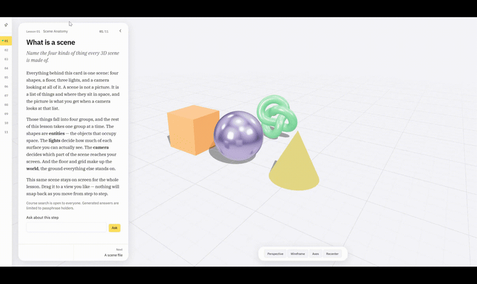
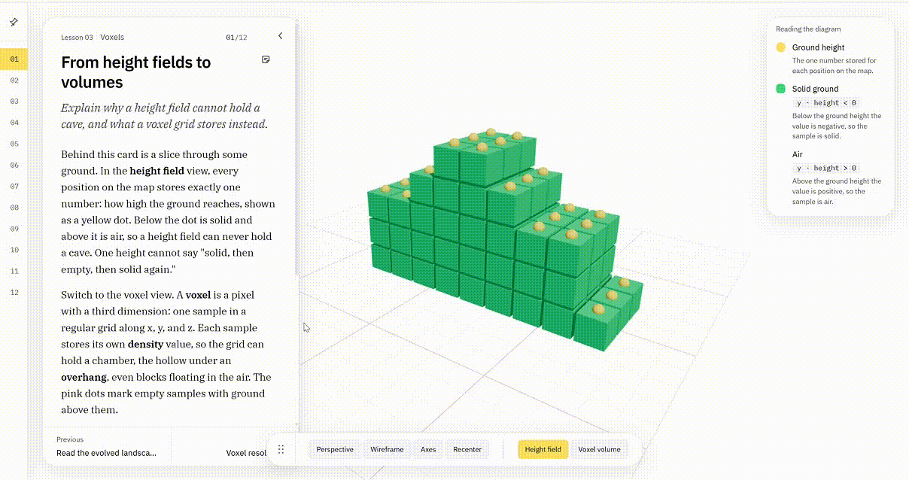
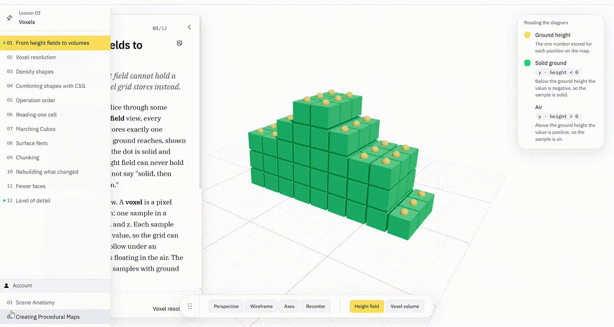

# Procedural World Building Project

This repository documents my work for DESIGN 4197/6197: Procedural World Building.

## Project Overview

This project will explore how procedural systems can be used to create interactive worlds, narratives, environments, or experiences. The direction will continue to evolve through research, experimentation, and prototyping during the semester.

## Repository Structure

- `docs/planning/` — project planning, feature ideas, and backlog
- `docs/tutorials/` — notes and documentation from tutorials
- `docs/analysis/` — analysis of references, precedents, and project experiments
- `docs/exercise/` — hands-on learning notes (a personal addition)

## Log

### Week 1 — Repository initialization (August 26–30, 2026)

View weekly details

- **Progress:** Initialized the repository, established the documentation structure, and created the initial feature backlog.
- **Key files:** `README.md`, `docs/planning/backlog.md`, `docs/tutorials/README.md`, `docs/analysis/README.md`
- **Keywords:** repository setup, project planning, documentation structure, feature backlog

### Week 2 — React Three Fiber fundamentals (August 31–September 6, 2026)

View weekly details

- **Progress:** Built an interactive React Three Fiber practice scene with geometry, materials, lighting, shadows, a world grid, and orbit camera controls. Added a reusable learning UI that connects DOM entity selection with the 3D scene, then documented both the prerequisite concepts and hands-on observations.
- **Key files:** `worldbuilding-guidebook/src/App.jsx`, `worldbuilding-guidebook/src/App.css`, `worldbuilding-guidebook/src/index.css`, `docs/tutorials/react-basics.md`, `docs/tutorials/threejs-react-scene.md`, `docs/exercise/01-r3f-baseline-scene.md`, `docs/exercise/02-scene-learning-ui.md`
- **Keywords:** React, JSX, CSS, Three.js, React Three Fiber, Drei, geometry, materials, lighting, shadows, camera, OrbitControls, DOM overlay, shared state, reusable UI

### Week 3 — Procedural maps: noise terrain and simulation-driven erosion (September 7–13, 2026)

View weekly details

- **Progress:** Built a function-based procedural map pipeline (grid → noise stack → 2D map → height field → 3D terrain) with White, Value, Perlin, and Cellular/Worley noise, plus adjustable frequency, octaves, persistence, and shaping controls, where the 2D map and 3D mesh read the same sampled values. Extended this into a simulation-driven map: a simplified hydraulic-erosion simulation that stores height, water, and sediment per cell, updates through double-buffered grids so every cell shares one definition of a timestep, and exposes Start/Pause/Step/Reset controls, a height-based material, and a wireframe toggle. Calibrated simulation resolution, terrain mesh resolution, world size, and height amplitude together to produce believable topography.
- **Key files:** `worldbuilding-guidebook/src/lessons/NoiseTerrainLesson.jsx`, `worldbuilding-guidebook/src/lessons/proceduralMaps/noiseMath.js`, `worldbuilding-guidebook/src/lessons/proceduralMaps/NoiseMapPreview.jsx`, `worldbuilding-guidebook/src/lessons/proceduralMaps/TerrainPreview.jsx`, `worldbuilding-guidebook/src/lessons/proceduralMaps/simulationMath.js`, `worldbuilding-guidebook/src/lessons/proceduralMaps/SimulationMapPreview.jsx`, `worldbuilding-guidebook/src/lessons/proceduralMaps/SimulationTerrainPreview.jsx`, `docs/exercise/03-interactive-terrain-playground.md`, `docs/exercise/04-simulation-driven-maps.md`
- **Keywords:** procedural maps, noise functions, Perlin noise, Worley/cellular noise, octave stack, height field, vertex displacement, hydraulic erosion simulation, double-buffered grid state, calibration, wireframe toggle

### Week 4 — Voxel terrain: density fields, meshing, chunking, and level of detail (September 14–20, 2026)

View weekly details

- **Progress:** Built Lesson 03, twelve steps of volumetric terrain, and recorded the results in Exercise 05. Terrain became a 3D density field with one sign rule (negative inside); shapes are combined with CSG (union, subtraction, intersection), and the order of the operations changes the result (11,994 versus 11,378 solid samples for the same three fields). Extracted the surface with Marching Cubes, whose case table is generated by the same rule the one-cell step draws, and compared it with Surface Nets: about the same number of faces, but roughly one Marching Cubes triangle in ten is a thin sliver against two to three in a hundred. Cut the volume into chunks and found that without a two-sample border a chunk cannot read the corners of its last row of cells, so 3 to 26 percent of the triangles go missing; with it, the chunks make exactly the triangles of the whole volume. Rebuilt only the chunks an edit reaches (about a quarter of the time for a dent in 4 × 4 × 4 chunks), added greedy meshing (30 to 43 percent of the faces of culled meshing), and gave chunks a camera-based level of detail, snapping the seams between levels together (largest height gap 0.36 → 0.01 world units). Web Workers, Dual Contouring and exact seam stitching are named and not built. The lesson is delivered through the course site built alongside it: content-driven steps, one shared canvas, code extracted from the real source, and practice tasks. Around the lesson: step legends, a per-step sticky note, a Grayscale view, an olive low-ground palette, rain and a water surface on the erosion terrain, a Chunk outlines toggle, and the course tutor shelved until every lesson is written. Wrote a Firebase tutorial and, on request, brought accounts forward from the roadmap's "after every lesson" plan: Authentication (email/password) and Firestore (one configuration document per user), plus Hosting, which is now the deployed production target in place of Vercel. Storage was deliberately left out — it now requires the paid Blaze plan, so the save/load feature stays Firestore-only (the latest save, no backup history) and the project stays on the free Spark plan. An Account drawer in the outline rail saves and loads a learner's scene params, view toggles, and progress. The spec's non-goal and roadmap entry for this were updated in place to record the exception, dated and reasoned, rather than left to disagree with the code.
- **Key files:** `worldbuilding-guidebook/content/lessons/03-voxels/`, `worldbuilding-guidebook/src/scene/demos/voxels/voxelMath.js`, `worldbuilding-guidebook/src/scene/demos/voxels/marchingCubes.js`, `worldbuilding-guidebook/src/scene/demos/voxels/surfaceNets.js`, `worldbuilding-guidebook/src/scene/demos/voxels/chunks.js`, `worldbuilding-guidebook/src/scene/demos/voxels/greedyMeshing.js`, `worldbuilding-guidebook/src/scene/demos/voxels/lodChunks.js`, `docs/exercise/05-voxel-terrain.md`, `docs/tutorials/firebase-setup.md`, `worldbuilding-guidebook/src/firebase/client.js`, `worldbuilding-guidebook/src/firebase/configSync.js`, `worldbuilding-guidebook/src/store/authStore.js`, `worldbuilding-guidebook/src/components/AccountDrawer.jsx`, `worldbuilding-guidebook/firestore.rules`, `worldbuilding-guidebook/firebase.json`
- **Keywords:** voxels, density field, signed distance field, CSG, Marching Cubes, Surface Nets, chunking, dirty-chunk remesh, greedy meshing, level of detail, seam snapping, Firebase, Authentication, Firestore, Hosting, cross-device configuration sync

