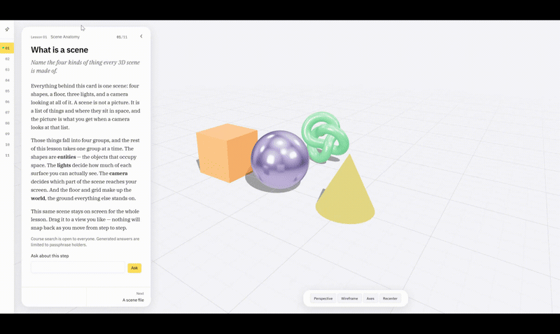
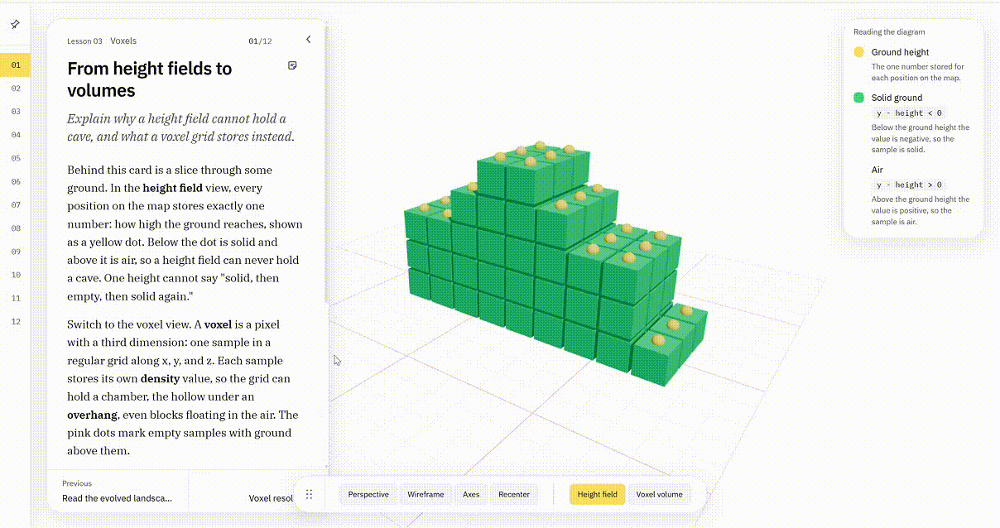
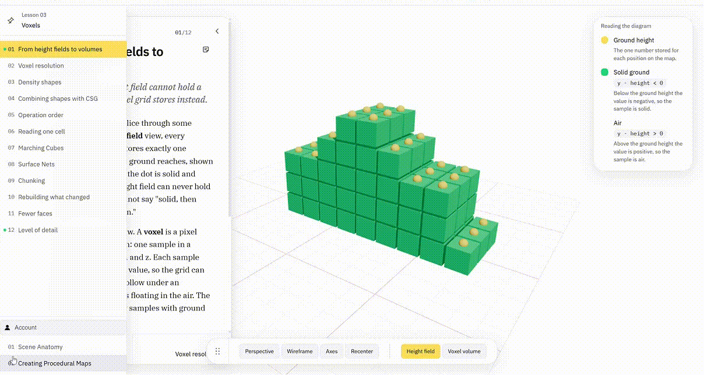
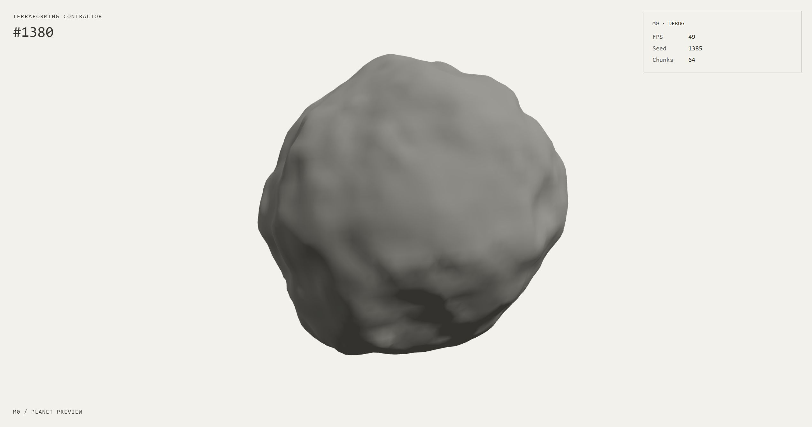
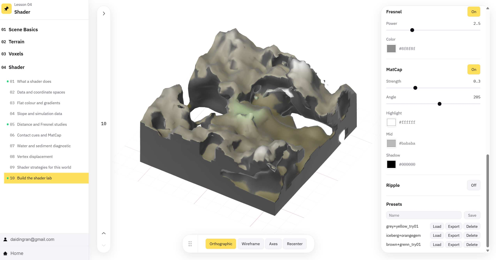
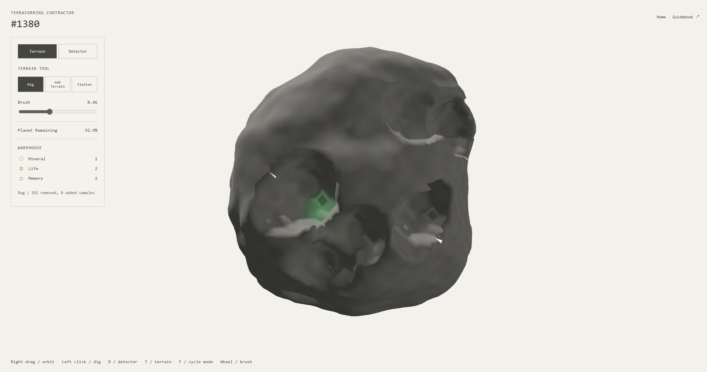

# Procedural World Building Project

This repository documents my work for DESIGN 4197/6197: Procedural World Building.

## Project Overview

This project explores procedural world building through an interactive learning guidebook and Terraforming Contractor #1380, a game prototype about scanning and reshaping a small planet. The guidebook develops terrain and shader techniques that feed into the game.

## Repository structure

```text
.
├── worldbuilding-guidebook/       Interactive learning site
│   ├── content/lessons/           Lesson text and step definitions (01–04)
│   ├── src/
│   │   ├── app/                   Routes and page layout
│   │   ├── components/            Lesson and control panels
│   │   ├── scene/demos/           Terrain, voxel, and shader scenes
│   │   ├── store/                 Scene, progress, and lab state
│   │   └── firebase/              Account configuration sync
│   ├── spec/                      Guidebook design and roadmap
│   ├── tests/                     Guidebook checks
│   └── README.md                  Local setup
├── terraforming-1380/            Independent game prototype
│   ├── src/
│   │   ├── world/                 Seeded planet and resource data
│   │   ├── tools/                 Dig, add, flatten, scan, collect
│   │   ├── views/                 Planet, camera, and detector views
│   │   └── state/                 Run state
│   ├── docs/                      Design, spec, decisions, roadmap
│   ├── tests/                     Planet and tool checks
│   └── README.md                  Controls and local setup
├── deployment/                   Shared Firebase Hosting site
│   ├── home/                      Project homepage
│   ├── home-scene/                Homepage planet illustration
│   ├── build.mjs                  Assemble all three site routes
│   ├── firebase.json              Hosting routes and redirects
│   └── README.md                  Build, preview, deploy
├── docs/
│   ├── tutorials/                 Background and setup notes
│   ├── exercise/                  Weekly experiments and findings
│   └── media/                     Screenshots and demo recordings
└── .github/workflows/             Shared site deployment jobs
```

Start with the [guidebook README](worldbuilding-guidebook/README.md) for the learning site, the [game README](terraforming-1380/README.md) for controls, or the [deployment README](deployment/README.md) to build the combined site. Each app has its own dependencies and build. Generated folders such as `node_modules/`, `dist/`, and `deployment/public/` are omitted from the tree.

## Shared website deployment

The project home runs at `/`, the guidebook at `/guidebook/`, and Terraforming Contractor #1380 at `/game/`.
Each app builds independently; `deployment/` combines their outputs for the
same Firebase Hosting site. See [build, preview and deploy instructions](deployment/README.md).
Use the shared deployment command instead of the old guidebook-only deploy command.

## Log

### Week 1 — Repository initialization (August 26–30, 2026)

<details>
<summary>View weekly details</summary>

- **Progress:** Initialized the repository, established the documentation structure, and created an initial feature backlog (later replaced by the project-specific plans).
- **Key files:** `README.md`, `docs/tutorials/README.md`, `docs/exercise/README.md`
- **Keywords:** repository setup, project planning, documentation structure, feature backlog

</details>

### Week 2 — React Three Fiber fundamentals (August 31–September 6, 2026)

<details>
<summary>View weekly details</summary>



- **Progress:** Built an interactive React Three Fiber practice scene with geometry, materials, lighting, shadows, a world grid, and orbit camera controls. Added a reusable learning UI that connects DOM entity selection with the 3D scene, then documented both the prerequisite concepts and hands-on observations.
- **Key files:** `worldbuilding-guidebook/src/App.jsx`, `worldbuilding-guidebook/src/App.css`, `worldbuilding-guidebook/src/index.css`, `docs/tutorials/react-basics.md`, `docs/tutorials/threejs-react-scene.md`, `docs/exercise/01-r3f-baseline-scene.md`, `docs/exercise/02-scene-learning-ui.md`
- **Keywords:** React, JSX, CSS, Three.js, React Three Fiber, Drei, geometry, materials, lighting, shadows, camera, OrbitControls, DOM overlay, shared state, reusable UI

</details>

### Week 3 — Procedural maps: noise terrain and simulation-driven erosion (September 7–13, 2026)

<details>
<summary>View weekly details</summary>


- **Progress:** Built a function-based procedural map pipeline (grid → noise stack → 2D map → height field → 3D terrain) with White, Value, Perlin, and Cellular/Worley noise, plus adjustable frequency, octaves, persistence, and shaping controls, where the 2D map and 3D mesh read the same sampled values. Extended this into a simulation-driven map: a simplified hydraulic-erosion simulation that stores height, water, and sediment per cell, updates through double-buffered grids so every cell shares one definition of a timestep, and exposes Start/Pause/Step/Reset controls, a height-based material, and a wireframe toggle. Calibrated simulation resolution, terrain mesh resolution, world size, and height amplitude together to produce believable topography.
- **Key files:** `worldbuilding-guidebook/content/lessons/02-procedural-maps/`, `worldbuilding-guidebook/src/scene/demos/proceduralMaps/noiseMath.js`, `worldbuilding-guidebook/src/scene/demos/proceduralMaps/NoiseMapPreview.jsx`, `worldbuilding-guidebook/src/scene/demos/proceduralMaps/TerrainPreview.jsx`, `worldbuilding-guidebook/src/scene/demos/proceduralMaps/simulationMath.js`, `worldbuilding-guidebook/src/scene/demos/proceduralMaps/SimulationMapPreview.jsx`, `worldbuilding-guidebook/src/scene/demos/proceduralMaps/SimulationTerrainPreview.jsx`, `docs/exercise/03-interactive-terrain-playground.md`, `docs/exercise/04-simulation-driven-maps.md`
- **Keywords:** procedural maps, noise functions, Perlin noise, Worley/cellular noise, octave stack, height field, vertex displacement, hydraulic erosion simulation, double-buffered grid state, calibration, wireframe toggle

</details>

### Week 4 — Voxel terrain: density fields, meshing, chunking, and level of detail (September 14–20, 2026)

<details>
<summary>View weekly details</summary>





- **Progress:** Built Lesson 03, twelve steps of volumetric terrain, and recorded the results in Exercise 05. Terrain became a 3D density field with one sign rule (negative inside); shapes are combined with CSG (union, subtraction, intersection), and the order of the operations changes the result (11,994 versus 11,378 solid samples for the same three fields). Extracted the surface with Marching Cubes, whose case table is generated by the same rule the one-cell step draws, and compared it with Surface Nets: about the same number of faces, but roughly one Marching Cubes triangle in ten is a thin sliver against two to three in a hundred. Cut the volume into chunks and found that without a two-sample border a chunk cannot read the corners of its last row of cells, so 3 to 26 percent of the triangles go missing; with it, the chunks make exactly the triangles of the whole volume. Rebuilt only the chunks an edit reaches (about a quarter of the time for a dent in 4 × 4 × 4 chunks), added greedy meshing (30 to 43 percent of the faces of culled meshing), and gave chunks a camera-based level of detail, snapping the seams between levels together (largest height gap 0.36 → 0.01 world units). Web Workers, Dual Contouring and exact seam stitching are named and not built. The lesson is delivered through the course site built alongside it: content-driven steps, one shared canvas, code extracted from the real source, and practice tasks. Around the lesson: step legends, a per-step sticky note, a Grayscale view, an olive low-ground palette, rain and a water surface on the erosion terrain, a Chunk outlines toggle, and the course tutor shelved until every lesson is written. Wrote a Firebase tutorial and, on request, brought accounts forward from the roadmap's "after every lesson" plan: Authentication (email/password) and Firestore (one configuration document per user), plus Hosting, which is now the deployed production target in place of Vercel. Storage was deliberately left out — it now requires the paid Blaze plan, so the save/load feature stays Firestore-only (the latest save, no backup history) and the project stays on the free Spark plan. An Account drawer in the outline rail saves and loads a learner's scene params, view toggles, and progress. The spec's non-goal and roadmap entry for this were updated in place to record the exception, dated and reasoned, rather than left to disagree with the code.
- **Key files:** `worldbuilding-guidebook/content/lessons/03-voxels/`, `worldbuilding-guidebook/src/scene/demos/voxels/voxelMath.js`, `worldbuilding-guidebook/src/scene/demos/voxels/marchingCubes.js`, `worldbuilding-guidebook/src/scene/demos/voxels/surfaceNets.js`, `worldbuilding-guidebook/src/scene/demos/voxels/chunks.js`, `worldbuilding-guidebook/src/scene/demos/voxels/greedyMeshing.js`, `worldbuilding-guidebook/src/scene/demos/voxels/lodChunks.js`, `docs/exercise/05-voxel-terrain.md`, `docs/tutorials/firebase-setup.md`, `worldbuilding-guidebook/src/firebase/client.js`, `worldbuilding-guidebook/src/firebase/configSync.js`, `worldbuilding-guidebook/src/store/authStore.js`, `worldbuilding-guidebook/src/components/AccountDrawer.jsx`, `worldbuilding-guidebook/firestore.rules`, `worldbuilding-guidebook/firebase.json`
- **Keywords:** voxels, density field, signed distance field, CSG, Marching Cubes, Surface Nets, chunking, dirty-chunk remesh, greedy meshing, level of detail, seam snapping, Firebase, Authentication, Firestore, Hosting, cross-device configuration sync

</details>

### Week 5 — Shader studies and Terraforming Contractor #1380

<details>
<summary>View weekly details</summary>

<!-- Week 5 guidebook demo GIFs will be added here. -->

#### Guidebook: shaders and a material lab

Expanded Lesson 04 into ten steps with interactive comparisons, source-linked GLSL examples, legends, and practice questions. The studies cover flat colour, height gradients and snow lines, slope-based rock, distance masks, Fresnel rims, MatCap shading, standing-water diagnostics, and animated vertex displacement. A separate coordinate-space demo compares local and world-space stripes across neighboring meshes. The MatCap legend previews the texture used by the material, and shader controls use ranges chosen to produce visible changes on the demo terrain.

The water study computes trapped rainwater from Ground's height function using a flood fill, then uploads the depths as a data texture. This is a static terrain diagnostic; live erosion and sediment data are not connected yet. The same Ground water map is used when switching to Caves or Floating islands, a limitation explained in the lesson. Vertex ripples change the rendered surface without editing the underlying density field.

Added a composite shader lab where height colours can be combined with rock, snow, water, scan, Fresnel, MatCap, and ripple layers. The panel exposes layer controls and colours, terrain shape and resolution, named presets, and JSON import/export. Configurations persist locally and are included in account saves. Added an "Apply to Final Project" star on lesson steps and in the outline, simplified lesson titles, and extended Firebase sync to load on sign-in and auto-save after a two-second pause in changes, with save status in the Account drawer.

#### Game: a planet to edit and inspect

Created `terraforming-1380/` as an independent Vite, React, and TypeScript app, with a game design document archive, current design and technical specifications, an M0–M7 roadmap, tuning notes, and decision records. M0 established the app, seeded run state, debug overlay, and planet placeholder.



M1 replaces the placeholder with a seeded sphere-plus-noise density field, extracted with Marching Cubes in chunks. It reuses copies of the guidebook's noise and voxel modules. Right-drag orbits a stationary planet; Dig, Add Terrain, and Flatten edit the density field and rebuild affected chunks. Brush size is adjustable. Flatten supports a local plane perpendicular to the planet radius or a global horizontal plane, with a matching preview. A remaining-volume estimate tracks terrain removal and addition, and a gray material with triplanar grain establishes the first visual treatment.





The M1.5 Detector scans a local patch, showing nearby terrain wireframe and distance-faded Mineral, Life, and Memory signals with distinct marker shapes. These targets are seeded proxies. Terrain edits that expose a target's center trigger basic collection, an animated transfer to the HUD, and category counts. Full deposits, resource economics, tool costs, first-person movement, and the story/endings remain later milestones; the prototype still needs human playtesting for tool feel and performance.

#### Shared site and repository maintenance

Added a project homepage with an interactive low-resolution Marching Cubes planet and a static fallback. The shared build assembles the homepage at `/`, guidebook at `/guidebook/`, and game at `/game/`. Firebase routing supports deep links and redirects old lesson URLs. Both GitHub deployment workflows now install the two apps, run game tests, and build the combined site through `deployment/`. Added a Hosting verification script for routes and assets, alongside game tests for seeded generation, terrain edits, detector behavior, and chunk borders.

Updated exercise notes and content audit artifacts, adjusted shader-specific lint settings, added Obsidian workspace configuration, and removed the old root planning backlog, analysis placeholder, and unused exercise image. Exercise 06 records the earlier shader observations, but some pending labels still need to catch up with the newer implementation. Guidebook GIFs will be added separately.

- **Key files:** [Shader lesson](worldbuilding-guidebook/content/lessons/04-shaders/), [shader demos](worldbuilding-guidebook/src/scene/demos/shaders/), [CompositeLabPanel.jsx](worldbuilding-guidebook/src/components/CompositeLabPanel.jsx), [compositeLabStore.js](worldbuilding-guidebook/src/store/compositeLabStore.js), [configSync.js](worldbuilding-guidebook/src/firebase/configSync.js), [game source](terraforming-1380/src/), [game roadmap](terraforming-1380/docs/roadmap.md), [game tests](terraforming-1380/tests/planet.test.ts), [deployment instructions](deployment/README.md), [shader study notes](docs/exercise/06-shader-studies.md)
- **Keywords:** GLSL, coordinate spaces, shader composition, MatCap, Fresnel, data textures, presets, automatic configuration sync, seeded planets, terrain editing, local scanning, resource collection, shared Firebase Hosting

</details>
