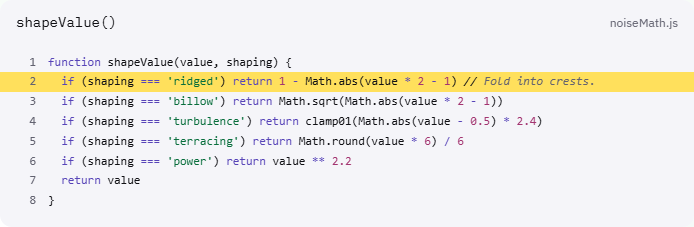

# Phase 3 — completed

Lesson 02 now has the approved two chapters, `1-functions` and `2-simulation`, with 12 steps each. All 24 steps contain 85–98 words of prose; 13 reference real extracted code. The existing content loader was unchanged.

## Implementation

- Added Acorn function extraction with attached comments, function expressions, arrow functions, and JSX parsing. Region extraction handles dedenting, nested markers, and CRLF sources. Missing or ambiguous identifiers, conflicting selectors, and invalid highlight lines fail the build.
- Wired extraction into `predev` and `prebuild`; `src/generated/snippets.json` is ignored by Git and keyed by the same step IDs as the loader.
- Added a custom Shiki light theme, source/function headers, unselectable line numbers, and snippet-relative solid yellow highlights. Only JavaScript and JSX grammars are loaded through the [Shiki synchronous core API](https://shiki.style/guide/sync-usage).
- Moved all Lesson 02 scene code into `src/scene/demos/proceduralMaps/`. Registered two demos and two 2D insets. Both demos use the existing SceneHost, camera, and controls.
- Prefixed parameters with `map` or `erosion`. Shared noise definitions are intentional; conflicting definitions throw instead of silently overwriting defaults.
- Simulation state persists between steps and playback reads `useSceneStore.isRunning`. Mesh resolution and amplitude preserve evolved state; changes to the initialization recipe rebuild it. Measurements expose cell spacing/count, mesh vertices, water amount, and height range.
- Added the captioned Q3 toggle with keyboard controls, a 400 ms geometry/color morph, reduced-motion cuts, and a pointer/keyboard divider over two clipped canvases. The actual Perlin versus Worley step uses it.
- Terrain and legend share the water/moss/summit tokens. World light/grid/water colors live in the world-color block of `tokens.css`.
- Prevented long control strips from covering card navigation. Controls remain reachable with a wide card and pinned outline at the 1024-pixel desktop minimum.
- Removed `src/lessons/`, its route and outline imports, and its navigation CSS. Lesson links now come from the content tree.

## Validation

- 11 Node tests passed: extractor success/failure paths, syntax contrast and tokenization, chapter structure, content references, parameter collisions, comparison state, and simulation persistence.
- 8 browser tests passed, including the focused rerun after correcting the screenshot test's focus handling. The outline intentionally stays expanded while focus is inside it.
- Browser checks walked all 24 real steps, crossed lesson/chapter boundaries, reloaded a deep link, and confirmed the Canvas DOM element persists. Camera orbit and Seed survive five actual route transitions. Simulation continues across routes and preserves its timestep through display edits.
- Actual comparison controls, pointer dragging, inset swapping, all four previews, five syntax colors, and unselectable numbers were verified. A component fixture additionally verifies intermediate morph geometry and reduced-motion cuts.
- `npm.cmd run lint` passed without warnings. `npm.cmd run build` passed and extracted 13 snippets. Vite reports its large-bundle warning; the build succeeds.
- `rg -n legacy src` returned no matches. `src/lessons/` is absent. There is exactly one JSX Canvas element in source, in SceneHost.
- Before removing the original files, 2,800 noise samples across all four families and seven shaping modes, plus 30 erosion timesteps, matched the migrated math exactly.

The in-app browser runtime had no available browsers; browser verification used installed local Chrome.

## Highlight-row evidence



This is the code block on **Shape the output**, not a content fixture. The highlighted second line contains all five syntax categories on the same solid summit fill. Visual inspection confirmed legible keywords, strings, numbers, identifiers, and italic comments.

| Syntax | Token | Contrast against summit |
| --- | --- | --- |
| Keywords | `--water-deep` | 5.50:1 |
| Strings | `--moss-deep` | 4.86:1 |
| Numbers | `--clay-deep` | 4.90:1 |
| Comments | `--ink-faint` | 4.59:1 |
| Identifiers | `--ink` | 14.53:1 |

The original string, number, and comment colors failed AA on yellow. Their text tokens were darkened to `#086e3c`, `#a33470`, and `#626270`. Tests verify all five against both paper-2 and summit, as well as the colors Shiki actually emits.

Screenshots: [full lesson with code](lesson-code.png), [Perlin/Worley comparison](compare.png), [simulation and measurements](simulation.png).

## Actual renamed-function build failure

The original math used `perlinNoise2D`; its migrated declaration and call site are named `perlin2d`, with unchanged math. I temporarily renamed the migrated declaration to `renamedPerlin2d` and ran `npm.cmd run build`. The actual Lesson 02 reference stopped prebuild:

```text
Code extraction failed: content/lessons/02-procedural-maps/chapters/1-functions/steps/05-perlin-versus-worley.mdx: missing function "perlin2d" in src/scene/demos/proceduralMaps/noiseMath.js
```

The source was restored before the successful final build. [Raw captured output](rename-build-error.txt).

## Scope

All six Phase 3 acceptance boxes in `spec/roadmap.md` are complete. The approved step structure is recorded in [phase3-step-proposal.md](../../spec/phase3-step-proposal.md). Practice, live editing, and tutor features remain in their later roadmap phases.
